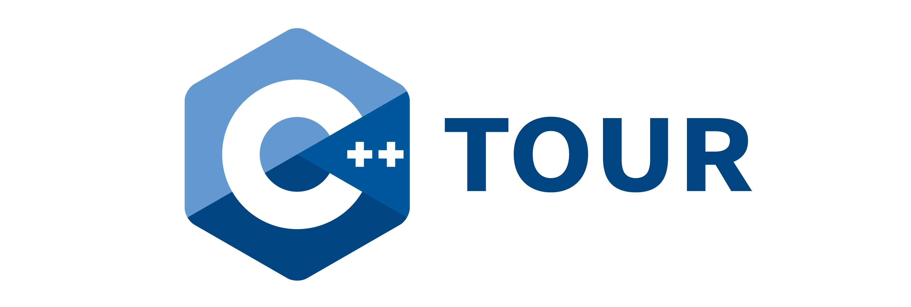

Welcome to the tour of C++.

# [Click Here to Take the Tour](https://cpp-tour.com)

Just here to take the tour? Go to [https://cpp-tour.com](https://cpp-tour.com).

# Table of Contents

- [Getting Started](#getting-started)
- [Mission Statement](#mission-statement)
- [Contributing](#contributing)
- [Contact Us](#contact-us)
- [Contributors](#contributors)
- [License](#license)

# Getting Started

## Build instruction

### Development

`npm start` - runs developement server on `localhost:3333`.  It automatically
re-builds changes.

### Production

`npm run build:p` builds production version with all optimizations.  It is
stored in directory `public/`

# Mission Statement

We strive to create a great way to easily get started with C++, no matter your
level of experience. You can read our full mission statement at [MISSION].

# Contributing

All contributions are welcome! We want to make the C++ tour a community effort,
and would like to hear your feedback, regardless of your level of expertise.

Please read the [CONTRIBUTING] before submitting a pull-request.

# Contact Us

You can find the C++ Tour team on the CppLang Slack [(click here to join)](https://cpplang.now.sh/)
in the `#cpp-tour` channel. We'll be happy to answer all of your questions.

# Contributors

The project is maintained by [Arvid Gerstmann](https://arvid.io).
It would, however, not be possible without the countless contributors. Thank you!

For the full list of contributors please read the [CONTRIBUTORS].

# License

All code is license under MIT. Copyright (c) 2017 Arvid Gerstmann.

All the content of the tour (found under `/lessons`) is licensed under
[CC-BY-SA 4.0](http://creativecommons.org/licenses/by-sa/4.0/).

[CONTRIBUTING]:         https://github.com/Leandros/cpp-tour/blob/dev/CONTRIBUTING.md#
[CHANGELOG on master]:  https://github.com/Leandros/cpp-tour/blob/master/CHANGELOG.md#
[CHANGELOG on dev]:     https://github.com/Leandros/cpp-tour/blob/dev/CHANGELOG.md#
[MISSION]:              https://github.com/Leandros/cpp-tour/blob/master/MISSION.md#
[CONTRIBUTORS]:         https://github.com/Leandros/cpp-tour/blob/master/CONTRIBUTORS.md#

